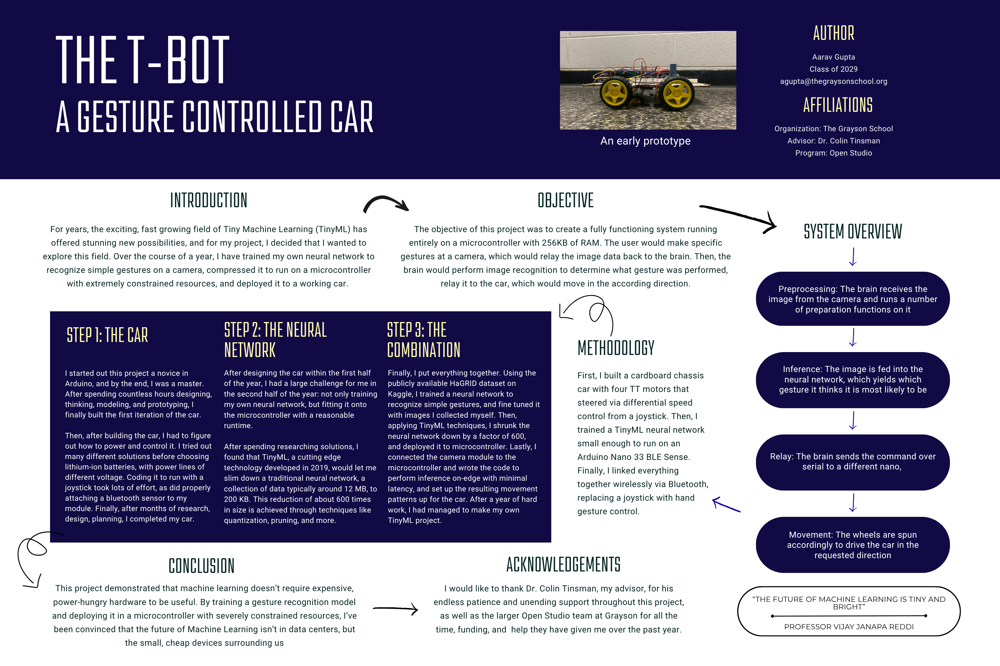

# The-TBot-A-Gesture-Controlled-Car
# TBot — Gesture-Controlled Car

A car controlled entirely through hand gestures, with no physical controller required. TBot uses computer vision and Bluetooth Low Energy (BLE) to translate gestures into real-time movement commands across a three-device embedded system.

---

## How It Works

